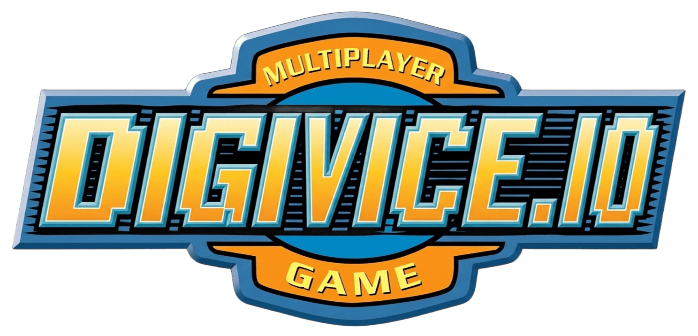

  

# Digivice.io

**Universidad de Costa Rica**  
CI-0127 - Desarrollo de Web  
Profesora: Mariana Núñez Arguedas

**Estudiantes:**
- Jeferson Marín C24549
- Agustín Soto C4K199
- Albin Monge C35000
- Juan Loaiza B74200

---

Digivice.io es un juego multijugador en tiempo real inspirado en la mecánica principal de Agar.io, pero con un sistema propio de evolución y combate, cada jugador controla un Digimon que se desplaza libremente por un mapa, recolecta distintos tipos de data y compite contra otros jugadores para sobrevivir. Durante la partida, los jugadores deberán decidir cómo utilizar los recursos que encuentren, ya sea para aumentar su tamaño, avanzar en la evolución de su Digimon o enfrentarse a otros jugadores, estas decisiones, junto con el movimiento y el uso estratégico de los ataques, determinarán el progreso de cada jugador.

El objetivo de la partida es sobrevivir y eliminar a los demás jugadores hasta ser el último jugador activo.

## 1\. Reglas del juego

**1\. Recolección de data**

Los jugadores pueden desplazarse libremente por el mapa y recolectar data de tipo Data, Vaccine y Virus, cada data aumenta el puntaje total del jugador y, conforme este puntaje aumenta, también crece el tamaño de su Digimon. Todos los data aumentan el puntaje, sin importar su tipo.

**2\. Sistema de evolución**

Cada Digimon tiene asignado un tipo de data necesario para evolucionar, por lo que únicamente los data correspondientes aumentan su barra de evolución, mientras que los demás solo aumentan su puntaje, al completar la barra, el Digimon avanza a la siguiente etapa, hasta alcanzar un máximo de tres evoluciones. La evolución no determina el tamaño del Digimon, por lo que un jugador puede llegar a ser muy grande incluso estando en su primera evolución, siempre que haya recolectado suficientes data.

**3\. Puntaje y puntos de vida**

El puntaje acumulado por el jugador también representa sus puntos de vida, entre más data recolecta, mayor será su tamaño y poder de ataque, recibir daño reduce estos puntos y, como consecuencia, también disminuye el tamaño del Digimon y su poder de ataque.

**4\. Combate por contacto**

Cuando dos Digimon colisionan, ambos se hacen daño continuamente mientras permanezcan en contacto, el daño causado no depende del tamaño del jugador, sino de su etapa de evolución, entonces un Digimon en evolución 1 tendrá un ataque normal de 8 %, en evolución 2 de 12 % y en evolución 3 de 16 %. De esta forma, un Digimon puede tener muchos puntos de vida y ser muy grande sin haber evolucionado, pero tendrá menor capacidad de ataque que un Digimon en una evolución superior.

**5\. Ataque especial**

El jugador puede utilizar un ataque especial a distancia presionando la barra espaciadora, este ataque permite causar daño sin necesidad de entrar en contacto directo con otro jugador, pero utilizarlo consume parte de sus propios puntos de vida, el costo del ataque especial aumenta según la evolución del Digimon, siendo de 4 % en evolución 1, 8 % en evolución 2 y 12 % en evolución 3\. Esta mecánica busca generar una decisión de riesgo y recompensa, ya que permite atacar desde una posición más segura, pero a cambio el jugador sacrifica parte de su propia vida y tamaño.

**6\. Eliminación**

Los puntos acumulados por el jugador también representan sus puntos de vida, por lo que, si estos llegan a 0, el Digimon queda eliminado de la partida y ya no puede continuar jugando.

**7\. Condición de victoria**

La partida se desarrollará durante un tiempo limitado y, conforme avance, el área jugable del mapa se irá reduciendo progresivamente, obligando a los jugadores a acercarse y enfrentarse entre sí, los jugadores que permanezcan fuera de la zona segura recibirán daño de forma continua hasta regresar al área permitida o ser eliminados. Durante toda la partida se mantendrá un scoreboard con el puntaje de los jugadores, al finalizar el tiempo, o cuando solo quede un jugador activo, el jugador con mayor puntaje será declarado ganador.

## 2\. Identidad propia del juego

Aunque Digivice.io toma como referencia la mecánica de movimiento, crecimiento y competencia de Agar.io, incorpora varias mecánicas propias que modifican de forma importante la manera de jugar, el crecimiento del Digimon depende del puntaje acumulado, mientras que su evolución se desarrolla de forma independiente mediante la recolección de un tipo específico de data, esto permite que un jugador pueda alcanzar un gran tamaño sin necesariamente haber evolucionado.

También el combate no consiste en absorber inmediatamente a otros jugadores, sino en causar daño de forma continua mediante contacto directo, cuyo poder depende de la etapa evolutiva del Digimon y se incorpora un ataque especial a distancia que consume parte de los propios puntos de vida del jugador, creando una mecánica de riesgo y recompensa.

Finalmente, la partida incorpora una zona segura que se reduce progresivamente, obligando a los jugadores a acercarse y enfrentarse conforme avanza el juego, mientras un scoreboard mantiene la clasificación según el puntaje obtenido.

Estas mecánicas permiten que Digivice.io conserve una base reconocible inspirada en Agar.io, pero con un sistema propio de evolución, combate, administración de recursos y cierre de partida.

## 3\. Justificación de complejidad

Digivice.io presenta una complejidad adecuada para un juego multijugador en tiempo real, ya que varios jugadores interactúan simultáneamente dentro de un mismo mapa y sus acciones modifican constantemente el estado de la partida, esto requiere mantener una sincronización continua entre los participantes para que todos reciban información consistente sobre lo que ocurre en el juego. Además, el resultado depende principalmente de la habilidad y las decisiones del jugador, como administrar sus recursos, elegir cuándo combatir y cuándo asumir riesgos, por lo que la victoria no está determinada únicamente por el azar.

## 4\. Estado que debe sincronizarse

Jugadores:

* Posición
* Puntos de vida/puntaje
* Tamaño
* Evolución actual
* Progreso de la barra de evolución
* Ataques especiales

Global:

* Jugadores vivos/eliminados
* Data del mapa
* Tiempo de la partida
* Dimensiones de la zona
* Ganador de la partida

## 5\. Cantidad de jugadores

Cada partida de Digivice.io tendrá un mínimo de 2 jugadores y estará diseñada inicialmente para soportar hasta 6 jugadores simultáneos, una cantidad adecuada para mantener partidas competitivas y facilitar la sincronización durante el desarrollo inicial. A futuro, se plantea ampliar esta capacidad hasta 32 jugadores por partida, conforme se optimice la arquitectura y el manejo del estado multijugador.

## 6\. Integrantes y roles

| Rol | Nombre | Carné |
| :---- | :---- | :---- |
| Frontend / maquetado | Jeferson Marín | C24549 |
| Cliente / lógica de juego (JavaScript) | Agustín Soto | C4K199 |
| Servidor / comunicación | Albin Monge Arias | C35000 |
| Diseño / QA / coordinación | Juan Loaiza | B74200 |

---